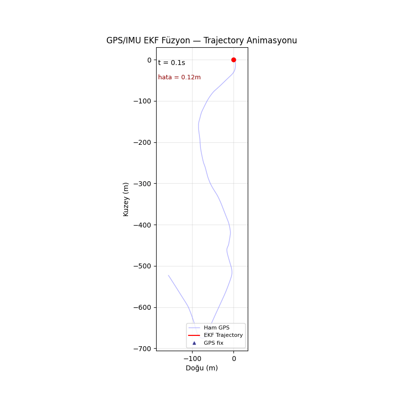

# GPS/IMU Sensor Fusion with Extended Kalman Filter

[](https://github.com/alikahraman61/gps-imu-fusion-ekf/actions)

Production-grade GPS + IMU tightly-coupled sensor fusion pipeline.  
Evaluated on KITTI Raw Dataset (drive 0034, 127s, 679m urban driving).



---

## Results

| Method | ATE RMSE | RPE RMSE |
|---|---|---|
| Raw GPS (baseline) | — | — |
| EKF Normal | 1.65 m | 0.58 m |
| Loosely-coupled | 6.09 m | — |
| Tightly-coupled | **1.57 m** | — |
| Adaptive EKF | 2.86 m (−28%) | — |
| Hybrid UKF | **1.43 m** | 1.55 m |
| GPS-Denied (IMU only) | 1109 m | 28.8 m |

> Hybrid UKF achieves **1.43m ATE** — 13% improvement over EKF.  
> GPS-denied IMU drift reaches **386m in 30 seconds**.  
> ZUPT reduces stationary drift by **996x**.

---

## Key Features

- **15-state EKF** — position, velocity, quaternion, accel bias, gyro bias
- **Hybrid UKF** — sigma-point mean + EKF Jacobian covariance (stable)
- **Adaptive noise estimation** — innovation-based online R update (Mehra 1970)
- **Allan Variance** — IMU noise characterization with ground-truth validation
- **ZUPT** — zero velocity update with IMU-only vs GPS-aided detector comparison
- **GPS-denied simulation** — IMU drift analysis with covariance visualization
- **Loosely vs tightly coupled** — quantitative comparison (74% improvement)
- **Mahalanobis outlier rejection** — GPS multipath protection
- **WGS84 → ENU** coordinate transformation
- **32 unit tests** — pytest, CI/CD via GitHub Actions
- **Docker** — single-command reproducible environment
- **Interactive dashboard** — Plotly HTML export

---

## Setup

```bash
python3 -m venv venv
source venv/bin/activate
pip install -r requirements.txt
```

**Docker:**
```bash
docker build -t kitti-fusion .
docker run kitti-fusion
```

---

## Dataset

[KITTI Raw Data](http://www.cvlibs.net/datasets/kitti/raw_data.php)  
Sequence: 2011_09_30_drive_0034 — 1224 frames, 127s, urban driving

---

## Run

```bash
python src/main.py
python src/evaluation.py
python src/run_ukf_comparison.py
python src/run_adaptive.py
python src/run_dashboard.py
```

---

## Tech Stack

Python · NumPy · SciPy · pykitti · GeographicLib · Matplotlib · Plotly · pytest · Docker · GitHub Actions

---

## References

- Mehra, R. (1970). On the identification of variances and adaptive Kalman filtering. IEEE TAC.
- Mohamed & Schwarz (1999). Adaptive Kalman filtering for INS/GPS. Journal of Geodesy.
- Crassidis & Markley (2003). Unscented Filtering for Spacecraft Attitude Estimation. JGCD.
- Wan & Van der Merwe (2000). The Unscented Kalman Filter for Nonlinear Estimation. IEEE ASSPCC.
